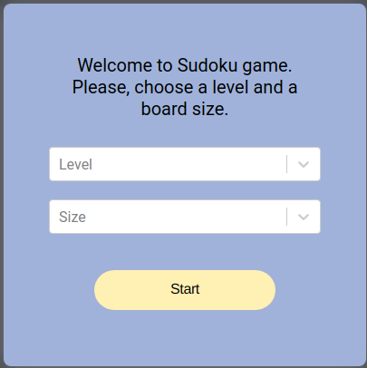
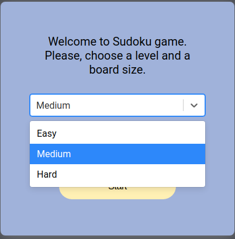
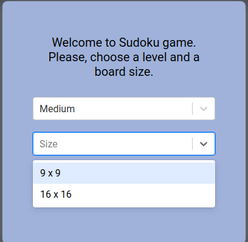
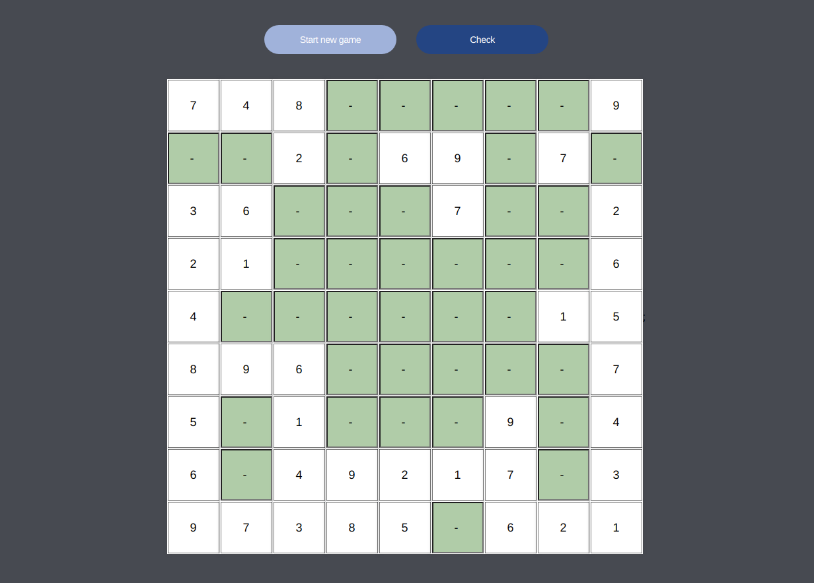
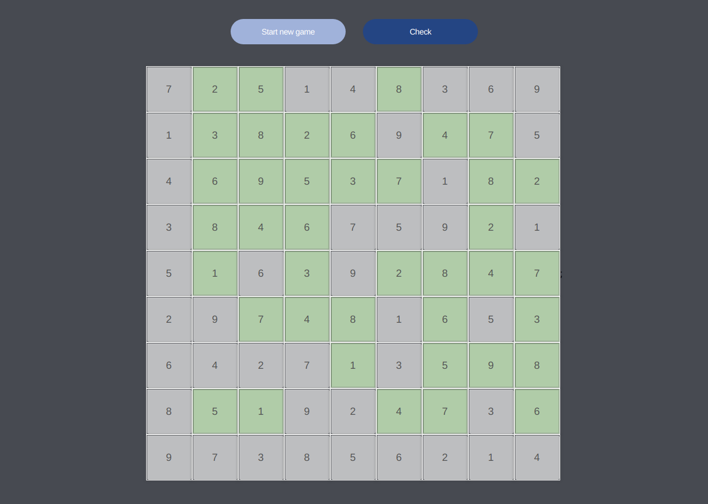

# sudoku-game
A simple sudoku game - only desktop version as for now. 
Used the following stack: html, scss, react, redux, typescript.

Deployed on Heroku - https://sudokugame-app.herokuapp.com/game.

Start page:

Level selection:

Size selection:

Game board:

Solved board:

